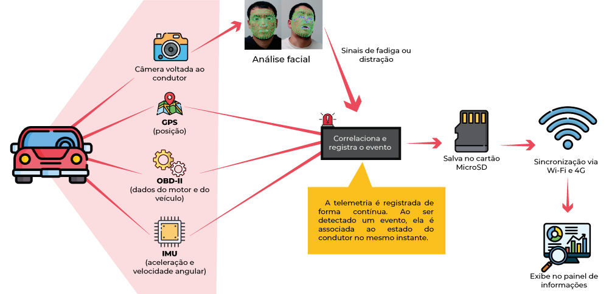

# V-GUARD

**Plataforma de telemetria multissensorial e monitoramento de segurança do motorista**

Registrador de bordo que grava, lado a lado, o estado do condutor e os dados do veículo no instante de cada evento detectado.

Projeto da disciplina Oficina de Integração 2 (EEX22) — Engenharia de Computação, UTFPR.

---

## Visão geral



As quatro fontes de dados embarcadas — câmera voltada ao condutor, GPS, OBD-II e IMU — alimentam continuamente a unidade de processamento. A análise facial sinaliza indícios de fadiga ou distração e, nesse instante, o sistema correlaciona o estado do condutor à telemetria do veículo, consolidando um evento único.

O registro é gravado no cartão MicroSD e sincronizado com o servidor assim que houver enlace: pela rede celular 4G seguem a telemetria e os metadados dos eventos, enquanto as fotografias são enviadas somente por uma rede Wi-Fi autorizada.

## O problema

Em 2025 foram registrados 72.529 sinistros nas rodovias federais brasileiras, com 83.550 feridos e 6.043 mortos. A falta de atenção e a sonolência ao volante responderam, respectivamente, por 32,3% e 6% dos sinistros fatais.

Uma câmera pode identificar sinais de sonolência, mas isoladamente não diz o que o veículo estava fazendo naquele momento. É essa correlação que o V-GUARD constrói.

## Arquitetura

| Nó | Função |
|---|---|
| ESP32 | Aquisição de IMU e OBD-II (via transceptor CAN); envia telemetria pela UART |
| Raspberry Pi 4 | Visão computacional, GPS, gerenciamento de eventos, armazenamento e sincronização |
| Módulo 4G/LTE | Enlace celular para telemetria e metadados |
| Backend | Recepção, persistência e API de consulta |
| Dashboard | Eventos, trajetória em mapa e fotografias |

**Operação offline-first:** a ausência de conectividade não interrompe nenhuma função principal. Um registro só é marcado como sincronizado após confirmação do backend; os estados de metadados e fotografia são mantidos separadamente.

## Estrutura do repositório

```
v-guard/
├── docs/            # proposta (LaTeX), diagramas, ADRs, datasheets
├── firmware/        # ESP32 — aquisição OBD-II, IMU, enlace UART
├── edge/            # Raspberry Pi — visão, eventos, storage, sync
├── backend/         # API e persistência
├── dashboard/       # interface web
├── hardware/        # esquemáticos KiCad, pinout, BOM
├── mecanica/        # CAD, STL, desenhos técnicos
├── tools/           # simulador OBD-II, gerador NMEA, scripts
└── gestao/          # cronograma, atas de reunião
```

## Tecnologias

- **Firmware:** C/C++ sobre RTOS
- **Borda:** Python, OpenCV, MediaPipe, SQLite
- **Backend:** FastAPI, PostgreSQL
- **Comunicação:** UART (ESP32 ↔ SBC), HTTPS/REST (dispositivo ↔ backend)
- **Hardware:** Raspberry Pi 4, ESP32, SIM7670G, câmera sem filtro IR

## Privacidade

O sistema não realiza streaming contínuo de vídeo nem identificação biométrica do condutor. O processamento visual ocorre localmente e apenas fotografias associadas a eventos detectados são armazenadas.

A operação pressupõe consentimento prévio e documentado do condutor monitorado.

> **Importante:** dados capturados (fotografias, vídeos, logs de telemetria) **não devem ser versionados neste repositório**. Ver `.gitignore`.

## Fora do escopo

O V-GUARD é um protótipo acadêmico passivo: observa e registra, sem atuar sobre os comandos do veículo. Não envia comandos de controle ao barramento CAN, não utiliza sensores fisiológicos de contato, não aciona serviços de emergência e não garante entrega de alertas em tempo real.

A lista completa de anti-requisitos está na proposta, em `docs/proposta/`.

## Equipe

- Nicolas Rossi Gariba
- Pedro Eugênio Marin do Nascimento
- Isabela Bella Bortoleto
- Thiago Moreira Gomes de Lima

**Docentes:** Prof. César M. Vargas Benítez e Prof. Daniel Rossato

## Links

- [Blog do projeto (Notion)](https://v-guard.notion.site/vguard?pvs=74)
- [Cronograma (Google Sheets)](https://docs.google.com/spreadsheets/d/1fUPYytr6a8WSai7smcVMS05EG_tIlTGWziotZdxk_qI/edit?usp=sharing)